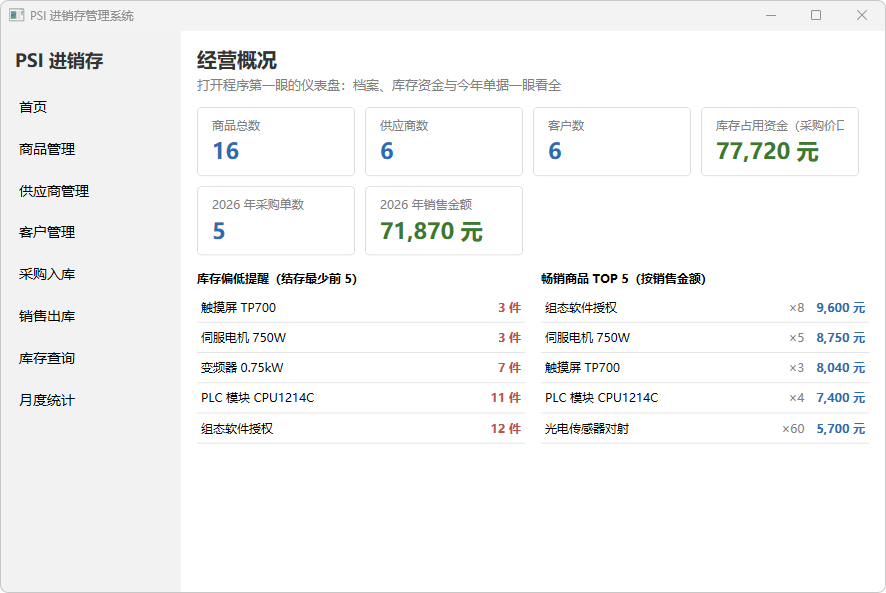
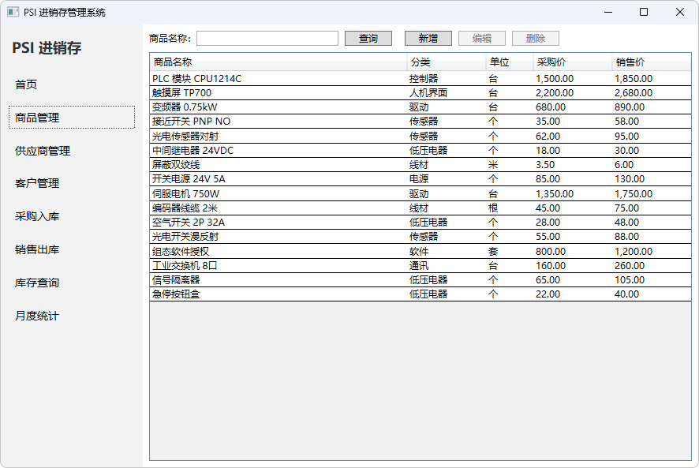
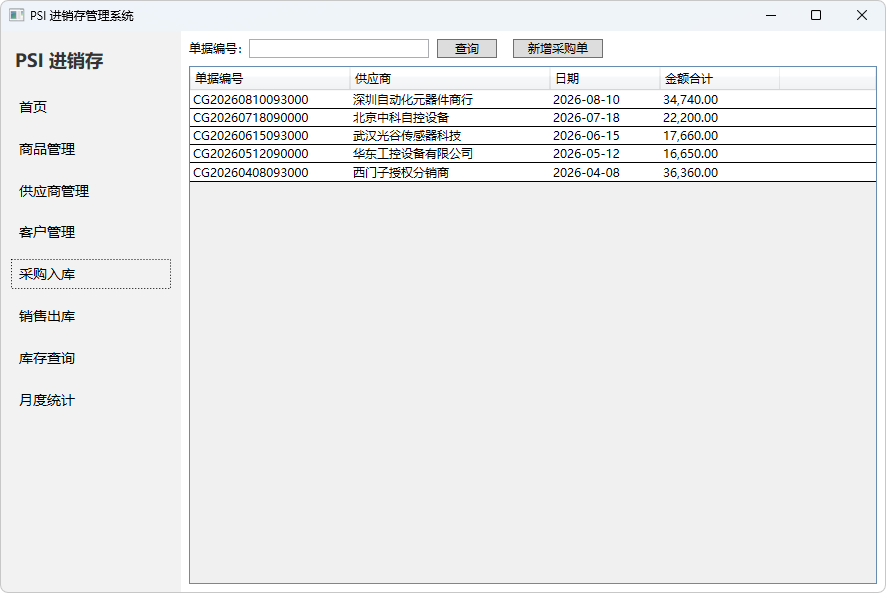
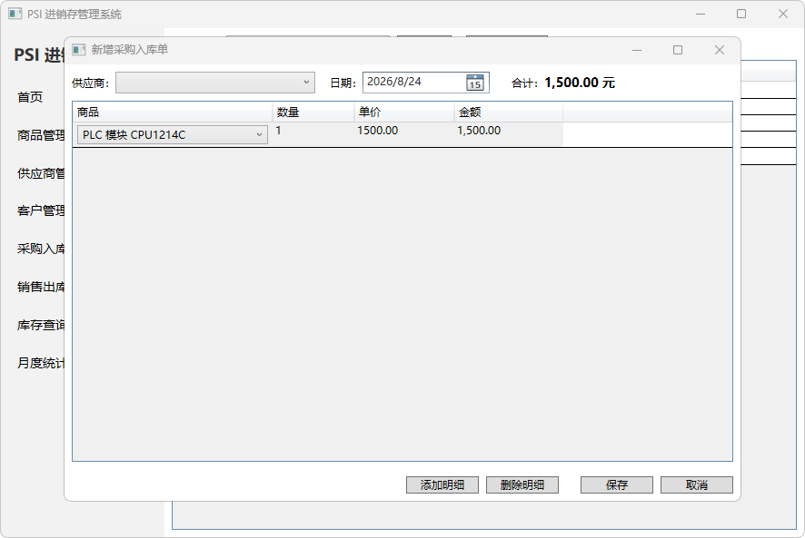
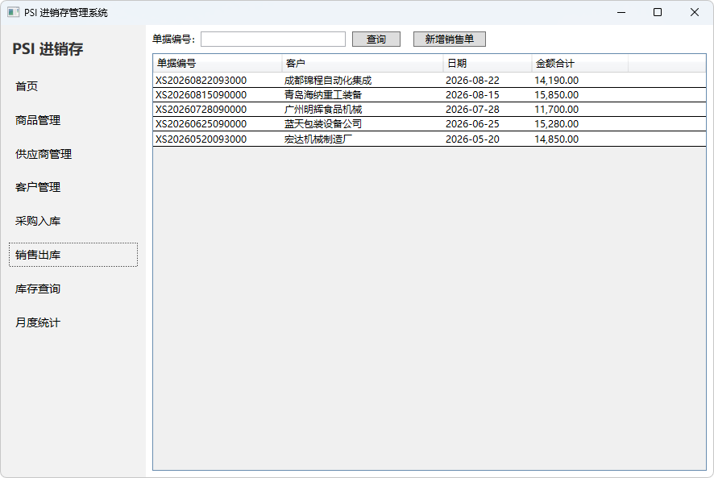
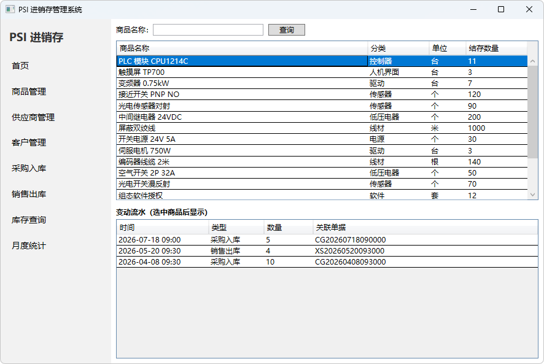
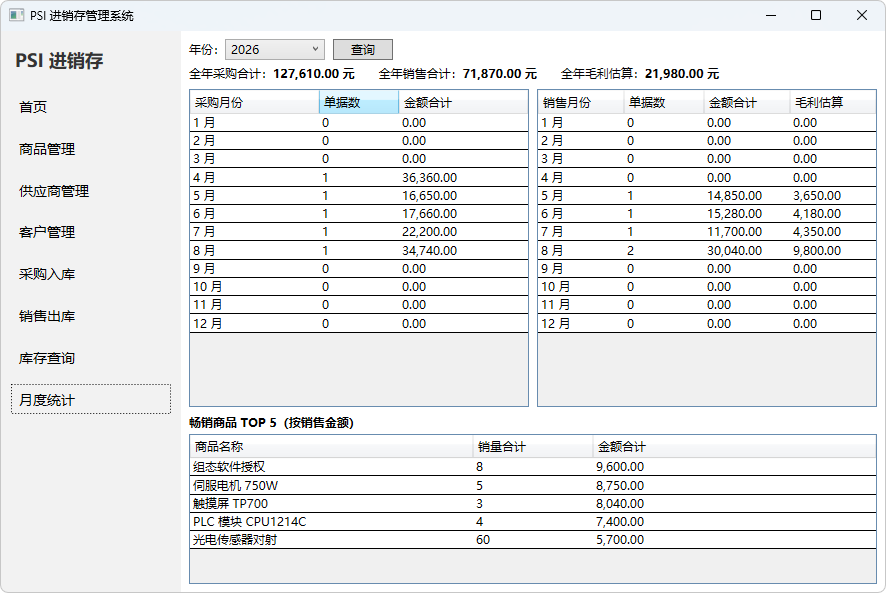

# PSI - Purchase-Sales-Inventory Management System

[中文](README.md) | [English](README.en.md)

   

A desktop Purchase-Sales-Inventory (PSI) management system built with WPF + .NET 8 + EF Core, covering the complete business loop: **master data → purchase inbound → sales outbound → inventory linkage → monthly reporting**.

Key point: **zero third-party MVVM frameworks and zero third-party UI libraries** — ObservableObject / RelayCommand / ViewModelBase / NavigationService are all hand-written, and the UI is built entirely with native WPF controls.

## Technology Choices

| Area | Choice | Rationale |
|---|---|---|
| Framework | .NET 8 WPF (SDK-style project) | Current mainstream desktop stack, native dotnet CLI support |
| Database | SQL Server LocalDB | Zero-config local development; seamless migration to a full SQL Server instance |
| ORM | EF Core 8 (Code First + Migrations) | Database schema evolves with the code; migration history is the schema changelog |
| MVVM | Hand-written infrastructure | Every line lives in the repo — explainable, modifiable, immune to framework upgrade churn |
| UI | Native WPF controls | No third-party license issues; every style is under control |

## Feature Modules

| Module | Description | Status |
|---|---|---|
| Home | Business overview dashboard (KPI cards, low-stock alerts, best-sellers) | ✅ |
| Products | Product CRUD | ✅ |
| Suppliers | Supplier CRUD | ✅ |
| Customers | Customer CRUD | ✅ |
| Purchase orders | Master-detail entry; stock increases on save | ✅ |
| Sales orders | Master-detail entry; stock decreases on save (with availability check) | ✅ |
| Inventory | Per-product stock balance + movement history | ✅ |
| Reporting | Monthly purchase/sales summary (fixed 12 months), gross-profit estimate & top-5 products | ✅ |

## Screenshots

| Home Dashboard | Product Management |
|:---:|:---:|
|  |  |
| 6 KPI cards + low-stock alerts + best-sellers | List + search + CRUD |

| Purchase Orders | Master-Detail Entry |
|:---:|:---:|
|  |  |
| Order list (stock updates on save) | Order header + detail lines, live totals |

| Sales Orders | Inventory |
|:---:|:---:|
|  |  |
| Availability check prevents overselling | Stock balance + movement history (linked) |

| Monthly Reporting |
|:---:|
|  |
| 12-month summary + gross profit + top 5 |

## Architecture

Classic MVVM layering (infrastructure introduced stage by stage during development):

```
View (XAML pages)           ← only describes how the UI looks
   ↕ bindings + commands
ViewModel                   ← UI state & interaction logic; never touches UI controls
   ↕ calls
Model / EF Core data layer  ← entities, DbContext, database read/write
```

## Quick Start

### Prerequisites

- Windows 10/11
- [.NET 8 SDK](https://dotnet.microsoft.com/download/dotnet/8.0)
- SQL Server LocalDB (bundled with Visual Studio; or install [SQL Server Express](https://www.microsoft.com/en-us/sql-server/sql-server-downloads) standalone)

### Run

```bash
git clone https://github.com/RobhcC/PSI-WPF.git
cd PSI-WPF

# First run: initialize the database (creates the PSI database in LocalDB with demo data:
# master data + purchase/sales orders + stock balances and logs, ready to explore out of the box)
dotnet tool install --global dotnet-ef --version 8.0.11
dotnet ef database update --project ./PSI

dotnet run --project ./PSI
```

## Project Structure

```
PSI-WPF/
├─ PSI.sln                 # solution
└─ PSI/                    # the single project (single-project layout)
   ├─ App.xaml             # application entry, specifies startup window
   ├─ MainWindow.xaml      # main window: left menu + content area (MVVM binding driven)
   ├─ MVVM/                # hand-written MVVM infrastructure
   │  ├─ ObservableObject  # INotifyPropertyChanged wrapper, property change notification
   │  ├─ RelayCommand      # ICommand wrapper, command binding
   │  ├─ ViewModelBase     # common base for all ViewModels
   │  └─ NavigationService # global navigation service
   ├─ Models/              # EF Core entities (products/suppliers/customers/purchase & sales master-detail/stock/logs)
   ├─ Data/                # AppDbContext (Fluent API config + seed data) and design-time factory
   ├─ Migrations/          # EF Core migrations (database schema version history)
   ├─ ViewModels/          # per-page ViewModels (lists, order editors, detail rows)
   ├─ Windows/             # edit dialogs (product/supplier/customer/purchase/sales)
   └─ Pages/               # feature pages (pure UI, no logic)
      ├─ HomePage          # home
      ├─ ProductPage / SupplierPage / CustomerPage   # the three master-data modules
      ├─ PurchasePage / SalePage                     # order list pages
      ├─ StockPage         # stock balance + movement history (master-detail)
      └─ ReportPage        # monthly purchase/sales summary
```

## Development Timeline

- [x] Project initialization (solution + WPF project + gitignore)
- [x] Main window shell and page navigation
- [x] MVVM infrastructure (ObservableObject / RelayCommand / ViewModelBase / NavigationService)
- [x] Data layer (entities, DbContext, EF migrations, seed data)
- [x] Product module CRUD
- [x] Supplier / customer modules
- [x] Purchase / sales orders (inventory linkage)
- [x] Inventory query + monthly reporting
- [x] Demo data expansion (consistent orders/stock/logs in every table) & reporting enhancements (gross-profit estimate, top-5 products)

Commits follow the [Conventional Commits](https://www.conventionalcommits.org/) convention, with each feature in its own commit. Full development history: [Commits](https://github.com/RobhcC/PSI-WPF/commits/main).
